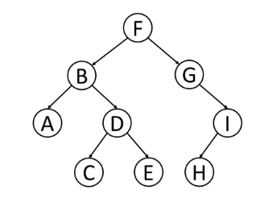
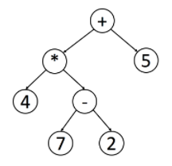

# Traversal binary tree

<p align="center">
  
</p>

## 3 traversal ways
+ Pre-order traversal binary tree (Root - Left - Right): F, B, A, D, C, E, G, I, H
+ Inorder traversal binary tree (Left - Root - Right): A, B, C, D, E, F, G, H, I
+ Postorder traversal binary tree (Left - Right - Root): A, C, E, D, B, H, I, G, F

## Notes
(Source: [traverse-a-tree](https://leetcode.com/explore/learn/card/data-structure-tree/134/traverse-a-tree/992/)). Also, post-order is widely use in mathematical expression. It is easier to write a program to parse a post-order expression. Here is an example:

<p align="center">
  
</p>

You can easily figure out the original expression using the inorder traversal. However, it is not easy for a program to handle this expression since you have to check the priorities of operations.

If you handle this tree in postorder, you can easily handle the expression using a stack. Each time when you meet a operator, you can just pop 2 elements from the stack, calculate the result and push the result back into the stack.

## Code implementation

```js
/**
 * Definition for a binary tree node.
 * class TreeNode {
 *     val: number
 *     left: TreeNode | null
 *     right: TreeNode | null
 *     constructor(val?: number, left?: TreeNode | null, right?: TreeNode | null) {
 *         this.val = (val===undefined ? 0 : val)
 *         this.left = (left===undefined ? null : left)
 *         this.right = (right===undefined ? null : right)
 *     }
 * }
 */

// Root - Left - Right
function preorderTraversal(root: TreeNode | null): number[] {
    if (root === null) return []
    return [root.val, ...preorderTraversal(root.left), ...preorderTraversal(root.right)]
};

// Left - Root- Right
function inorderTraversal(root: TreeNode | null): number[] {
    if (root === null) return []
    return [...inorderTraversal(root.left), root.val, ... inorderTraversal(root.right)]
};

// Root - Left - Right
function postorderTraversal(root: TreeNode | null): number[] {
    if (root === null) return []
    return [... postorderTraversal(root.left), ... postorderTraversal(root.right), root.val]
};
```
